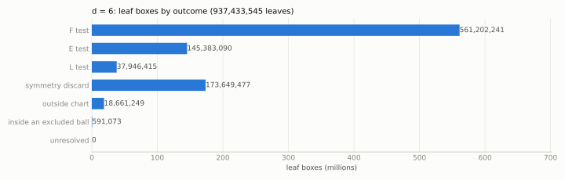
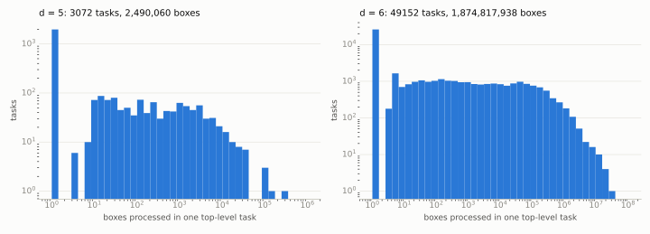
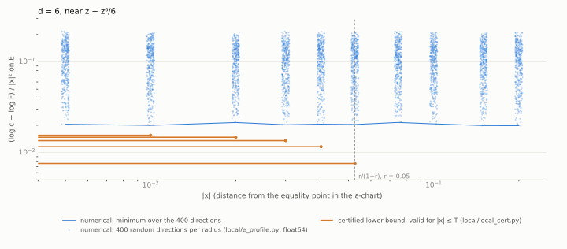

# Smale's mean value conjecture, degree 6: computation and certificates

Status: **computational results, not peer reviewed.** First published 2026-09-30.

Archived on Zenodo: [doi:10.5281/zenodo.23068019](https://doi.org/10.5281/zenodo.23068019) (all versions; release v1.2 is
[doi:10.5281/zenodo.23068020](https://doi.org/10.5281/zenodo.23068020)). The Zenodo archive contains the repository; the
$`d = 6`$ subdivision tree (`d6.canonical.tree.zst`, 381 MB) is attached to the GitHub releases v1.1 and v1.2.

For a complex polynomial $`P`$ of degree $`d`$ and a point $`z`$ with $`P'(z) \neq 0`$, Smale's mean value conjecture
concerns the smallest constant $`K`$ such that some critical point $`c`$ of $`P`$ satisfies

```math
\lvert P(z) - P(c)\rvert \le K\,\lvert z - c\rvert\,\lvert P'(z)\rvert .
```

The conjectured sharp value is $`K = (d-1)/d`$, attained by $`z - z^d/d`$ at $`z = 0`$.

This repository contains a computation for $`d = 6`$ (constant $`5/6`$), intended to show that the sharp value holds in
degree 6. It has three parts:
1. an equal-modulus reduction (`REDUCTION.md`);
2. a branch-and-bound cover of a compact 8-dimensional chart in rigorous floating-point ball arithmetic (`c/`,
   `runs/d6_v2/`);
3. an interval-arithmetic second-order certificate near the extremal configuration (`local/`).

The same code applied to $`d = 5`$ is included (`runs/d5_v2/`).

## Normalisation

Take $`z = 0`$, $`P(0) = 0`$ and $`P'(0) = 1`$, with critical points $`b_1, \dots, b_n`$ ($`n = d - 1`$). The quantity to bound is

```math
F(B) = \min_i \lvert S_i\rvert, \qquad S_i = \frac{P(b_i)}{b_i} = \int_0^1 \prod_j \Bigl(1 - t\,\frac{b_i}{b_j}\Bigr)\,dt .
```

The chart: $`b_1 = 1`$ is a critical point of minimal modulus, $`u_j = 1/b_j`$ and $`\lvert u_j\rvert \le 1`$, reduced by
symmetry to $`\lvert u_2\rvert \ge \dots \ge \lvert u_n\rvert`$ and $`\mathrm{Im} u_2 \ge 0`$. The chart has real
dimension $`2(d-2) = 8`$. For $`i \ge 2`$,

```math
S_i = \frac{T_i}{u_i^{\,n-1}}, \qquad T_i = \int_0^1 (1-t)(u_i - t) \prod_{j \ne 1, i} (u_i - t\,u_j)\,dt ,
```

where $`T_i`$ is a polynomial. The configurations at which the bound is attained, and around which the local certificate is placed, are $`u = (\bar\omega^{a_2}, \dots, \bar\omega^{a_n})`$ with
$`\omega = e^{2\pi i/n}`$ and $`(a_j)`$ a permutation of $`1, \dots, n-1`$; there are 24 for $`d = 6`$. (The proof does not characterise maximisers whose moduli are not all equal.)

## Method (outline)

- **Reduction** (`REDUCTION.md`). Some point of the closure of the image of $`(S_1, \dots, S_n)`$ attains $`\sup F`$ with
  all $`\lvert S_i\rvert`$ equal. The proof follows Crane and Ng and uses convexity of amoeba complements; it does not
  assume that a maximiser exists. A finite cover of the closed chart by closed boxes then suffices, provided every
  box either lies in a small ball around an equality point, where the local certificate applies, or passes one of the
  following tests uniformly on the box. Here $`c = (d-1)/d`$.
  - **F:** some $`\lvert S_i\rvert \lt  c`$.
  - **E:** some $`\lvert S_i\rvert \ne \lvert S_j\rvert`$, so the box misses $`E = \{\lvert S_1\rvert = \dots = \lvert S_n\rvert\}`$.
  - **L:** $`\frac1n \sum_i \log\lvert S_i\rvert \lt  \log c`$.
- **Branch and bound** (`c/smale_bb_v2.c`).
  - Each $`T_i`$ is expanded exactly at the box centre, with coefficients as complex balls. This gives interval bounds
    and first-order affine models of $`\log\lvert S_i\rvert`$, from which the F, E and L tests are evaluated.
  - The start grid is $`4^8`$ boxes of half-width $`1/4`$. Boxes that pass no test are bisected.
  - A box is set aside only if it lies inside the closed Euclidean $`u`$-ball of radius $`0.05`$ around an equality point.
  - The arithmetic is binary64 round-to-nearest ball arithmetic with an explicit error term for every operation, and
    the correctly rounded logarithm of CORE-MATH (`third_party/core-math-log/`). The error analysis is
    `c/ERROR_ANALYSIS_v2.md`.
  - Each finished top-level task is written as one checksummed record, bound to a hash of the source and the
    configuration. `c/check_done.py` checks the records and the grid coverage independently.
- **Local certificate** (`local/LOCAL_CERT.md`). On $`E`$, within $`\lVert\varepsilon\rVert_2 \le 0.0527`$ of the
  equality point in the chart $`b_j = \omega^{j-1} e^{\varepsilon_j}`$, it shows
  $`\log F \le \log\frac56 - 0.00757\,\lVert\varepsilon\rVert_2^2`$. It uses Taylor models of degree 6 in arb ball
  arithmetic, and exact arithmetic in $`\mathbb{Q}(\omega)`$ for the zeroth- and first-order terms. The $`u`$-balls of
  radius $`0.05`$ map into $`\lVert\varepsilon\rVert_2 \le 0.05/0.95 = 1/19 \lt  0.0527`$.
- **Second local certificate** (`local2/`). A separate implementation, written from the specification
  `local2/SPEC.md` only, proves $`L \le \log\frac56 - 0.0151\,\lVert x\rVert_2^2`$ on $`E`$ for $`\lVert x\rVert_2 \le 1/19`$.
  It uses no logarithms: it bounds $`\Phi = \lvert S_1/c\rvert^2 - 1`$ through $`F = \Phi + \sum_a \mu_a D_a`$, where
  $`D_a = \lvert S_{a+1}/c\rvert^2 - \lvert S_1/c\rvert^2`$ vanishes on $`E`$. Its hand-over radius is $`\log(20/19) \lt  1/19`$.

## Results

| | $`d = 5`$ | $`d = 6`$ |
|---|---|---|
| top-level tasks | 3 072 | 49 152 |
| boxes processed | 2 490 060 | 1 874 817 938 |
| leaves closed by F / E / L | 757 590 / 143 562 / 100 008 | 561 202 241 / 145 383 090 / 37 946 415 |
| leaves outside chart / symmetry / excluded ball | 37 156 / 205 334 / 2 916 | 18 661 249 / 173 649 477 / 591 073 |
| unresolved boxes | 0 | 0 |
| maximum subdivision depth | 47 | 71 |
| task CPU time | 7 s | 23 735 s |
| `c/check_done.py` | CERTIFICATE COMPLETE (`runs/d5_v2/CHECK.txt`) | CERTIFICATE COMPLETE (`runs/d6_v2/CHECK.txt`) |
| local certificate bound $`g(T)`$, $`T = 0.0527`$ | $`\le -0.02284`$ | $`\le -0.0075740986`$ |
| independent local certificate (`local2/`): $`\kappa`$ at radius $`T`$ | | $`\kappa \gt  0.0151`$ at $`T = 1/19`$; $`\kappa \gt  0.0013`$ at $`T = 1/8`$ |

Source sha256 `8ddcec1767e0b64b404843cc0e0d99684b6526ef9c6d34288129a89fe0b9487f` (`c/smale_bb_v2.c`). Binary
sha256 `e99fdb885004db53961c411065372595540137ca3f78b654b0da96019aa08723` (Apple clang 21.0.0, arm64; see
`runs/d6_v2/BUILD.txt`). `runs/d6_v2/d6.done` sha256
`0f8199fb3b360623e1ee7e493bfb530da7868483340f85222caaa96a2db0506b`.

## Independent check in arb

A second program, `c/arbcheck/arbcheck.c`, checks the $`d = 6`$ result in FLINT/arb ball arithmetic. It was written
from the specification `c/arbcheck/SPEC.md` and the mathematics only, independently of `c/smale_bb_v2.c` and of its
error analysis.

1. `c/export_tree.c` reruns the subdivision of every task with `c/smale_bb_v2.c` and writes the tree, one byte per
   node. Its per-task counts are identical to `runs/d6_v2/d6.done` on all 49 152 tasks
   (`runs/d6_arbcheck/export_vs_done.txt`).
2. `arbcheck` reads the same tasks file and the tree. For every leaf it proves the leaf's claim in arb, by its own
   bounds: F, E, L, outside the chart, symmetry, or inside a closed Euclidean ball of radius $`1/20`$ around an
   equality point. It checks that each record is exactly one complete tree and that every task id occurs exactly
   once. A leaf that is not proved directly may be bisected further by the checker, and then every piece must be proved.

| | $`d = 5`$ | $`d = 6`$ |
|---|---|---|
| leaves | 1 246 566 | 937 433 545 |
| proved directly | 1 246 566 | 937 433 427 |
| proved after further bisection by the checker | 0 | 118 (240 sub-boxes in total) |
| failures / missing tasks | 0 / 0 | 0 / 0 |
| CPU time | 10 s | 12 151 s |

Logs: `runs/d5_arbcheck/arbcheck.log`, `runs/d6_arbcheck/arbcheck.log`; versions and hashes:
`runs/d6_arbcheck/BUILD.txt`. The $`d = 6`$ tree is attached to release v1.1 as `d6.canonical.tree.zst`: the records are
in increasing id order, and the file's sha256 equals the canonical digest printed by `c/tree_digest.py`,
`db22fef3393a3d208b0f20dc94e3ddedd92d9d4d724af602081a0e55bccfc823`. The compressed file is 381 024 434 bytes, with sha256
`b53da6959b7ce068722db2159e966b21792abdf81e30c1a957b188d82f494690`.

## Figures

Regenerate with `python3 figures/make_figures.py` (matplotlib).

<picture>
  <source media="(prefers-color-scheme: dark)" srcset="figures/outcomes_dark.svg">
  
</picture>

Leaf boxes of the $`d = 6`$ subdivision by the test or rule that closed them (`runs/d6_v2/d6.done`).

<picture>
  <source media="(prefers-color-scheme: dark)" srcset="figures/tasks_dark.svg">
  
</picture>

Boxes processed per top-level task, for $`d = 5`$ and $`d = 6`$.

<picture>
  <source media="(prefers-color-scheme: dark)" srcset="figures/distance_dark.svg">
  
</picture>

$`d = 6`$: boxes processed per task, against the distance from the task centre to the nearest equality point
(`runs/d6_v2/d6.done`, `runs/d6_v2/d6.tasks`).

<picture>
  <source media="(prefers-color-scheme: dark)" srcset="figures/local_dark.svg">
  
</picture>

$`(\log c - \log F)/\lVert x\rVert^2`$ on $`E`$ near the equality point ($`d = 6`$). The dots are float64 samples (`runs/e_profile_d6.tsv`),
and the line is their minimum at each radius.
Each segment is a certified lower bound, valid for $`\lVert x\rVert \le T`$ (`runs/local_cert_v3_d6_T*.log`). The dashed line marks
the radius that the excluded balls map into.

## Contents

| path | content |
|---|---|
| `REDUCTION.md` | equal-modulus reduction (Proposition R) and the form in which the computation uses it |
| `c/smale_bb_v2.c` | branch-and-bound evaluator (its sha256 is bound into every run record) |
| `c/build_v2.sh` | build command; writes `BUILD.txt` (compiler, hashes, fused-multiply-add scan) |
| `c/ERROR_ANALYSIS_v2.md` | per-operation floating-point error analysis of the evaluator |
| `c/check_done.py` | independent completion checker (exact-rational grid, records, configuration) |
| `c/progress.py` | progress of a running job |
| `c/regress/` | task replay, equality-point certification (arb), primitive checks, targeted regression |
| `third_party/core-math-log/` | CORE-MATH correctly rounded log (MIT licence, upstream commit in `UPSTREAM_COMMIT`) |
| `runs/d6_v2/`, `runs/d5_v2/` | build records, task lists, per-task records (`*.done`), unresolved lists (empty), checker output |
| `c/arbcheck/` | independent FLINT/arb checker of the subdivision tree (`SPEC.md`, `arbcheck.c`, `Makefile`, `README.md`) |
| `c/export_tree.c`, `c/tree_digest.py` | writes the subdivision tree of a run; canonical digest of a tree file |
| `runs/d6_arbcheck/`, `runs/d5_arbcheck/` | arb check logs, versions and hashes; export versus run records |
| `local2/` | a second local certificate, implemented from its specification (`SPEC.md`) only: statement, method, code, run log |
| `local/` | local certificate (`local_cert.py`, `exact_facts.py`, `LOCAL_CERT.md`), Jacobian rank check, numerical checks |
| `runs/local_cert_v3_*.log` | local certificate outputs |
| `runs/e_profile_d6.tsv` | numerical samples on $`E`$ (figure data) |
| `runs/regress_v2/` | outputs of the regression scripts |
| `src/smale.py` | float64 evaluation of $`S_i`$ (used by the numerical checks) |
| `figures/` | figures and the script that makes them |
| `MANIFEST.sha256` | sha256 of every file |

## Reproduce

Requirements: a C compiler; Python 3 with `mpmath`, `numpy`, `sympy`, `python-flint` (arb) and `matplotlib`.
Versions used: Apple clang 21.0.0 on macOS arm64 (Apple M5), Python 3.9.6, python-flint 0.6.0, mpmath 1.3.0,
numpy 1.26.4, sympy 1.14.0, matplotlib 3.9.4.

```sh
# build (writes OUT/smale_bb_v2.bin and OUT/BUILD.txt)
c/build_v2.sh OUT

# check the published run: records, configuration, source hash, exact grid coverage
python3 c/check_done.py runs/d6_v2/d6 --build runs/d6_v2/BUILD.txt
python3 c/check_done.py runs/d5_v2/d5 --build runs/d5_v2/BUILD.txt
# with an identical toolchain the binary hash also matches: add --bin OUT/smale_bb_v2.bin

# recompute a random sample of d=6 tasks and compare with the records (add task ids to include specific ones)
python3 c/regress/replay_tasks.py OUT/smale_bb_v2.bin runs/d6_v2/d6 50

# full rerun (about 24 000 CPU-seconds for d = 6; resumable), then check
OUT/smale_bb_v2.bin run 6 0.05 4 3 OUT/d6 2 1
python3 c/check_done.py OUT/d6 --build OUT/BUILD.txt --bin OUT/smale_bb_v2.bin

# equality points (certified in arb), primitives, targeted regression
python3 c/regress/eqpoints_v2.py OUT/smale_bb_v2.bin
cc -O2 -ffp-contract=off -DSRC_SHA256_RAW=0 -Ithird_party/core-math-log -o OUT/prim_test c/regress/prim_test_v2.c third_party/core-math-log/log.c -lpthread
OUT/prim_test | python3 c/regress/prim_check_v2.py
python3 c/regress/regress_v2.py OUT/smale_bb_v2.bin runs/d5_v2/d5 OUT/regress

# independent arb check (needs FLINT >= 3): export the tree (about 7 CPU-hours for d = 6), check it (about 3.4 CPU-hours)
(cd c/arbcheck && make)
cc -O2 -ffp-contract=off -fno-fast-math -std=gnu11 -DSRC_SHA256_RAW=$(shasum -a 256 c/smale_bb_v2.c | cut -d' ' -f1) -Ic -Ithird_party/core-math-log -o OUT/export_tree c/export_tree.c third_party/core-math-log/log.c -lpthread
OUT/export_tree 6 0.05 runs/d6_v2/d6.tasks OUT/d6 3
python3 c/regress/cmp_export_counts.py OUT/d6.counts runs/d6_v2/d6.done   # runs/d6_arbcheck/export_vs_done.txt
python3 c/tree_digest.py OUT/d6.tree                     # compare with runs/d6_arbcheck/BUILD.txt
c/arbcheck/arbcheck -t 3 --quiet 6 runs/d6_v2/d6.tasks OUT/d6.tree
# or check the released tree directly: zstd -d d6.canonical.tree.zst, then run arbcheck on d6.canonical.tree

# local certificate (about 1 minute each), exact facts, Jacobian rank
python3 local/local_cert.py 6 0.0527
python3 local/local_cert.py 5 0.0527
bash local2/run_all.sh                                  # second local certificate, about 15 s; writes local2/run_T1_19.log
python3 local/exact_facts.py 4 5 6 7
python3 local/rank_check.py 6

# figures
python3 figures/make_figures.py
```

## Assumptions

The arithmetic argument (`c/ERROR_ANALYSIS_v2.md` §A.1) assumes:
- IEEE-754 binary64 operations, correctly rounded to nearest with gradual underflow;
- a compiler that neither contracts nor reassociates floating-point expressions;
- correct rounding of the compiled CORE-MATH `cr_log`.

The local certificate assumes the correctness of arb (python-flint).

## References

- S. Smale, The fundamental theorem of algebra and complexity theory, Bull. Amer. Math. Soc. 4 (1981) 1–36.
- D. Tischler, Critical points and values of complex polynomials, J. Complexity 5 (1989) 438–456.
- E. Crane, Topics in conformal geometry and dynamics, PhD thesis, Cambridge, 2003 (degree 2004).
- E. Crane, Extremal polynomials in Smale's mean value conjecture, Comput. Methods Funct. Theory 6 (2006) 145–163.
- E. Crane, A bound for Smale's mean value conjecture for complex polynomials, Bull. London Math. Soc. 39 (2007)
  781–791.
- A. Conte, E. Fujikawa, N. Lakic, Smale's mean value conjecture and the coefficients of univalent functions,
  Proc. Amer. Math. Soc. 135 (2007) 3295–3300.
- T. W. Ng, Smale's mean value conjecture and related problems, slides, workshop "Hausdorff Geometry of Polynomials and
  Polynomial Sequences", Institut Mittag-Leffler, 2018, https://staff.math.su.se/shapiro/IMLConference/Ng.pdf.
- B. Sendov, P. Marinov, On the mean value conjectures of Smale and Tischler, East J. Approx. 12 (2006) 353–366.
- B. Sendov, P. Marinov, Verification of Smale's mean value conjecture for $`n \le 10`$, C. R. Acad. Bulgare Sci. 60
  (2007) 1151–1156 (numerical).
- Z. Liu, Smale's mean value conjecture in degree six: certified enclosures and a cancellation obstruction,
  preprint, Zenodo, 2026, doi:10.5281/zenodo.22390113 (record created 2026-09-05; the record's publication-date field
  reads 2023-02-05).
- A. Jatar, T. W. Ng, Smale's mean value conjecture and its dual conjecture for complex polynomials,
  arXiv:2608.27047 (2026).
- T. Adamczewski, https://github.com/tadamcz/mean-value-problem (2026): Lean formalisation of a claimed disproof of the
  conjecture with $`K = 1`$ in very large degree; machine-checked, not human-reviewed; not examined here.
- I. M. Gelfand, M. M. Kapranov, A. V. Zelevinsky, Discriminants, resultants, and multidimensional determinants,
  Birkhäuser, 1994.
- M. Forsberg, M. Passare, A. Tsikh, Laurent determinants and arrangements of hyperplane amoebas, Adv. Math. 151
  (2000) 45–70.
- A. Sibidanov, P. Zimmermann, S. Glondu, The CORE-MATH project, ARITH 2022.
